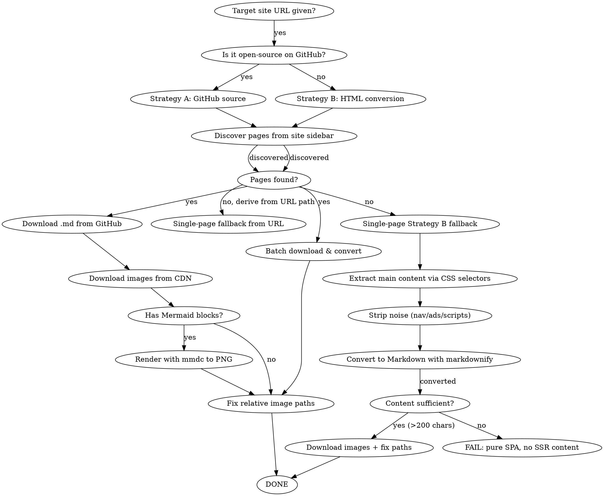

# web-to-local-md Strategy B Optimization Plan

> **For agentic workers:** REQUIRED SUB-SKILL: Use superpowers:subagent-driven-development (recommended) or superpowers:executing-plans to implement this plan task-by-task. Steps use checkbox (`- [ ]`) syntax for tracking.

**Goal:** Add HTML-to-Markdown direct extraction fallback (Strategy B) so the script can handle SSR sites that currently return 0 pages, increasing golden test set success from 31/54 to 48/54.

**Architecture:** When sidebar discovers 0 pages, fall back to single-page extraction: fetch URL → parse HTML with BeautifulSoup → find main content container via CSS selector heuristics → strip noise (nav/footer/ads) → convert to Markdown with markdownify → localize images → save. This is a pure Python addition to the existing script, no new dependencies (beautifulsoup4 and markdownify are already installed).

**Tech Stack:** Python 3, BeautifulSoup4, markdownify, requests (already installed)

---

## File Structure

| File | Responsibility |
|------|----------------|
| `skills/web-to-local-md/scripts/web_to_local_md.py` | Core script — add Strategy B extraction functions and fallback logic |
| `skills/web-to-local-md/scripts/test_extraction.py` | Test file — unit tests for all new extraction functions |
| `skills/web-to-local-md/SKILL.md` | Skill definition — update decision flowchart and documentation |
| `skills/web-to-local-md/references/common-issues.md` | Add Strategy B troubleshooting section |

The Python script currently has 411 lines in a single file. We're adding ~150 lines of new functions (content extraction, noise removal, image localization, enhanced fetching). The script stays as one file since all functions share the same pipeline context.

---

### Task 1: Smart Content Extractor

Add `extract_main_content()` function that finds the main article body in HTML using CSS selector heuristics, with a fallback chain.

**Files:**
- Modify: `skills/web-to-local-md/scripts/web_to_local_md.py` (add after `strip_frontmatter` function, around line 92)
- Create: `skills/web-to-local-md/scripts/test_extraction.py`

- [ ] **Step 1: Write the failing test**

Create `skills/web-to-local-md/scripts/test_extraction.py`:

```python
"""Tests for web-to-local-md content extraction functions."""
import pytest
from web_to_local_md import extract_main_content

def test_extract_article_tag():
    """Content inside <article> should be extracted."""
    html = '<html><body><nav>skip</nav><article><h1>Title</h1><p>Content paragraph.</p></article><footer>skip</footer></body></html>'
    result = extract_main_content(html)
    assert '<h1>Title</h1>' in result
    assert '<p>Content paragraph.</p>' in result
    assert 'skip' not in result

def test_extract_role_main():
    """Content inside role=main should be extracted when no <article>."""
    html = '<html><body><nav>skip</nav><div role="main"><h2>Heading</h2><p>Main text here.</p></div></body></html>'
    result = extract_main_content(html)
    assert '<h2>Heading</h2>' in result
    assert 'Main text here.' in result
    assert 'skip' not in result

def test_extract_main_tag():
    """Content inside <main> should be extracted."""
    html = '<html><body><header>skip</header><main><p>Main content only.</p></main></body></html>'
    result = extract_main_content(html)
    assert 'Main content only.' in result
    assert 'skip' not in result

def test_extract_known_class():
    """Known content class names should be found."""
    html = '<html><body><div class="sidebar">skip</div><div class="article-content"><p>Article text.</p></div></body></html>'
    result = extract_main_content(html)
    assert 'Article text.' in result
    assert 'sidebar' not in result

def test_extract_cnblogs_id():
    """Blog-specific IDs like cnblogs_post_body should be found."""
    html = '<html><body><div id="header">skip</div><div id="cnblogs_post_body"><p>Blog content.</p></div></body></html>'
    result = extract_main_content(html)
    assert 'Blog content.' in result
    assert 'header' not in result

def test_fallback_to_body():
    """When no specific container found, fall back to <body>."""
    html = '<html><head><title>Test</title></head><body><p>Only body content.</p></body></html>'
    result = extract_main_content(html)
    assert 'Only body content.' in result

def test_empty_html():
    """Empty or very short HTML should return None."""
    html = '<html><body></body></html>'
    result = extract_main_content(html)
    assert result is None

def test_short_html():
    """HTML with less than 200 chars of text should return None."""
    html = '<html><body><p>Short</p></body></html>'
    result = extract_main_content(html)
    assert result is None
```

- [ ] **Step 2: Run test to verify it fails**

Run: `cd skills/web-to-local-md/scripts && python -m pytest test_extraction.py -v`
Expected: FAIL — `ModuleNotFoundError` or `ImportError` for `extract_main_content`

- [ ] **Step 3: Write the `extract_main_content` implementation**

Add this function in `skills/web-to-local-md/scripts/web_to_local_md.py` after `strip_frontmatter` (around line 92):

```python
# ─── Content Extraction (Strategy B) ───

def extract_main_content(html):
    """Extract the main content from HTML using CSS selector heuristics.
    
    Returns the inner HTML of the best content container found,
    or None if no meaningful content can be extracted.
    """
    from bs4 import BeautifulSoup
    
    if not html or len(html) < 500:
        return None
    
    soup = BeautifulSoup(html, 'html.parser')
    
    # Priority-ordered selector chain for known content containers
    selectors = [
        # Semantic HTML5
        'article',
        '[role="main"]',
        'main',
        # Common doc site patterns
        '.article-content',
        '.post-content',
        '.main-content',
        '.content-body',
        '.documentation',
        '.doc-content',
        '#content',
        '#main-content',
        # Chinese tech blog patterns
        '#cnblogs_post_body',          # 博客园
        '.article__content',           # SegmentFault
        '#article-content',            # 阿里云开发者社区
        '.topic-richtext',             # 知乎专栏
        '.Post-RichTextContainer',     # 知乎专栏新版
        # Cloud/docs patterns
        '.awsui-text-container',       # AWS docs
        '.content',                    # Generic fallback
    ]
    
    for sel in selectors:
        elements = soup.select(sel)
        for el in elements:
            text = el.get_text(strip=True)
            # Must have substantial content (>200 chars of actual text)
            if len(text) > 200:
                return str(el)
    
    # Fallback: use <body> but strip noise first
    body = soup.find('body')
    if body:
        # Remove known noise elements
        for tag in body.find_all(['nav', 'header', 'footer', 'aside']):
            tag.decompose()
        for tag in body.find_all(class_=re.compile(r'sidebar|menu|nav|breadcrumb|cookie|ad|banner|promo|share|comment|footer|header')):
            tag.decompose()
        for tag in body.find_all(id=re.compile(r'sidebar|nav|header|footer|menu|comment')):
            tag.decompose()
        
        text = body.get_text(strip=True)
        if len(text) > 200:
            return str(body)
    
    return None
```

- [ ] **Step 4: Run test to verify it passes**

Run: `cd skills/web-to-local-md/scripts && python -m pytest test_extraction.py -v`
Expected: 8 tests PASS

- [ ] **Step 5: Commit**

```bash
git add skills/web-to-local-md/scripts/web_to_local_md.py skills/web-to-local-md/scripts/test_extraction.py
git commit -m "feat(web-to-local-md): add extract_main_content() with CSS selector heuristics"
```

---

### Task 2: Noise Removal

Add `strip_noise()` function to remove navigation, sidebars, ads, scripts, and styles from extracted HTML content before markdown conversion.

**Files:**
- Modify: `skills/web-to-local-md/scripts/web_to_local_md.py` (add after `extract_main_content`)
- Modify: `skills/web-to-local-md/scripts/test_extraction.py` (add tests)

- [ ] **Step 1: Write the failing tests**

Add to `skills/web-to-local-md/scripts/test_extraction.py`:

```python
from web_to_local_md import strip_noise

def test_strip_scripts_and_styles():
    """Script and style tags should be removed."""
    html = '<div><script>alert("xss")</script><style>.foo{color:red}</style><p>Keep this.</p></div>'
    result = strip_noise(html)
    assert 'alert' not in result
    assert '.foo' not in result
    assert 'Keep this.' in result

def test_strip_nav_header_footer():
    """Nav, header, footer tags should be removed."""
    html = '<div><nav><a href="/home">Home</a></nav><p>Content here.</p><footer>Copyright 2024</footer></div>'
    result = strip_noise(html)
    assert 'Home' not in result
    assert 'Copyright' not in result
    assert 'Content here.' in result

def test_strip_aside():
    """Aside tags should be removed."""
    html = '<div><aside><p>Sidebar note</p></aside><p>Main text.</p></div>'
    result = strip_noise(html)
    assert 'Sidebar note' not in result
    assert 'Main text.' in result

def test_strip_noise_classes():
    """Elements with noise class names should be removed."""
    html = '<div><div class="breadcrumb"><a>Home</a></div><div class="cookie-banner">Accept cookies</div><p>Real content.</p></div>'
    result = strip_noise(html)
    assert 'Home' not in result
    assert 'Accept cookies' not in result
    assert 'Real content.' in result

def test_preserve_code_blocks():
    """Pre/code blocks should NOT be stripped."""
    html = '<div><pre><code>def hello():\n    pass</code></pre><p>Text.</p></div>'
    result = strip_noise(html)
    assert 'def hello()' in result
    assert 'Text.' in result
```

- [ ] **Step 2: Run test to verify it fails**

Run: `cd skills/web-to-local-md/scripts && python -m pytest test_extraction.py::test_strip_scripts_and_styles -v`
Expected: FAIL — `ImportError` for `strip_noise`

- [ ] **Step 3: Write the `strip_noise` implementation**

Add in `skills/web-to-local-md/scripts/web_to_local_md.py` after `extract_main_content`:

```python
NOISE_CLASSES = [
    'sidebar', 'menu', 'nav', 'navigation', 'breadcrumb',
    'cookie', 'cookie-banner', 'ad', 'ads', 'advertisement',
    'banner', 'promo', 'promotion', 'share', 'social-share',
    'comment', 'comments', 'disqus', 'footer', 'header',
    'toc', 'table-of-contents', 'related', 'recommend',
    'tags', 'tag-list', 'pagination', 'pager',
]

NOISE_IDS = [
    'sidebar', 'nav', 'navigation', 'header', 'footer',
    'menu', 'comments', 'comment', 'disqus_thread',
    'breadcrumb', 'toc',
]

def strip_noise(html):
    """Remove navigation, sidebars, ads, scripts, styles from HTML content.
    
    Preserves <pre>, <code>, <table>, , and semantic content tags.
    """
    from bs4 import BeautifulSoup
    
    soup = BeautifulSoup(html, 'html.parser')
    
    # Remove script/style tags entirely
    for tag in soup.find_all(['script', 'style', 'noscript']):
        tag.decompose()
    
    # Remove semantic noise tags
    for tag in soup.find_all(['nav', 'header', 'footer', 'aside']):
        tag.decompose()
    
    # Remove elements by noise class names
    for tag in soup.find_all(class_=NOISE_CLASSES):
        tag.decompose()
    
    # Remove elements by noise IDs (id parameter accepts string or regex, not list)
    noise_id_pattern = '|'.join(NOISE_IDS)
    for tag in soup.find_all(id=re.compile(noise_id_pattern)):
        tag.decompose()
    
    return str(soup)
```

Note: BeautifulSoup's `class_` parameter accepts a list and matches any element whose class list contains ANY of the strings. Same for `id`.

- [ ] **Step 4: Run test to verify it passes**

Run: `cd skills/web-to-local-md/scripts && python -m pytest test_extraction.py -v`
Expected: All tests PASS (13 total)

- [ ] **Step 5: Commit**

```bash
git add skills/web-to-local-md/scripts/web_to_local_md.py skills/web-to-local-md/scripts/test_extraction.py
git commit -m "feat(web-to-local-md): add strip_noise() to remove nav/ads/scripts from HTML"
```

---

### Task 3: Enhanced HTTP Fetching

Add `fetch_url()` function with better headers, timeout, and retry logic. Replace all `urllib.request` calls with `requests` library (already installed).

**Files:**
- Modify: `skills/web-to-local-md/scripts/web_to_local_md.py` (add `fetch_url`, refactor `download_github_md` and `download_image` to use requests)
- Modify: `skills/web-to-local-md/scripts/test_extraction.py` (add tests)

- [ ] **Step 1: Write the failing tests**

Add to `skills/web-to-local-md/scripts/test_extraction.py`:

```python
from web_to_local_md import fetch_url

def test_fetch_url_success():
    """fetch_url should return HTML for a valid URL."""
    result = fetch_url('https://httpbin.org/html')
    assert result is not None
    assert len(result) > 100
    assert 'Moby Dick' in result  # httpbin's default HTML content

def test_fetch_url_404():
    """fetch_url should return None for 404 URLs."""
    result = fetch_url('https://httpbin.org/status/404')
    assert result is None

def test_fetch_url_with_headers():
    """fetch_url should use enhanced headers by default."""
    # This is verified indirectly — the function uses Mozilla UA + Referer
    # We test it doesn't crash with a real site
    result = fetch_url('https://httpbin.org/user-agent')
    assert result is not None
    assert 'Mozilla' in result  # Default headers include Mozilla UA
```

- [ ] **Step 2: Run test to verify it fails**

Run: `cd skills/web-to-local-md/scripts && python -m pytest test_extraction.py::test_fetch_url_success -v`
Expected: FAIL — `ImportError` for `fetch_url`

- [ ] **Step 3: Write the `fetch_url` implementation and refactor existing functions**

Add at the top of `skills/web-to-local-md/scripts/web_to_local_md.py` (after imports, before `SidebarParser`):

```python
import requests as req_lib

DEFAULT_HEADERS = {
    'User-Agent': 'Mozilla/5.0 (Windows NT 10.0; Win64; x64) AppleWebKit/537.36 (KHTML, like Gecko) Chrome/120.0.0.0 Safari/537.36',
    'Accept': 'text/html,application/xhtml+xml,application/xml;q=0.9,*/*;q=0.8',
    'Accept-Language': 'en-US,en;q=0.9,zh-CN;q=0.8,zh;q=0.7',
    'Accept-Encoding': 'gzip, deflate',
    'Connection': 'keep-alive',
}

def fetch_url(url, headers=None, timeout=15):
    """Fetch a URL with enhanced headers and error handling.
    
    Returns HTML text on success, None on failure (404, 403, timeout, etc).
    """
    h = headers or DEFAULT_HEADERS
    try:
        r = req_lib.get(url, headers=h, timeout=timeout, allow_redirects=True)
        if r.status_code == 200:
            return r.text
        print(f"  HTTP {r.status_code} for {url}")
        return None
    except req_lib.exceptions.Timeout:
        print(f"  Timeout fetching {url}")
        return None
    except req_lib.exceptions.RequestException as e:
        print(f"  Request error: {e}")
        return None
```

Then refactor `download_github_md` to use requests:

```python
def download_github_md(github_repo, source_path, save_path, branch='main'):
    """Download a markdown file from GitHub raw URL."""
    url = f"https://raw.githubusercontent.com/{github_repo}/{branch}/{source_path}"
    try:
        r = req_lib.get(url, headers=DEFAULT_HEADERS, timeout=30)
        if r.status_code == 200:
            content = r.content
            with open(save_path, 'wb') as f:
                f.write(content)
            return content.decode('utf-8', errors='ignore')
        print(f"  GitHub download failed: HTTP {r.status_code}")
        return None
    except req_lib.exceptions.RequestException as e:
        print(f"  GitHub download failed: {e}")
        return None
```

And refactor `download_image`:

```python
def download_image(url, save_path):
    """Download an image from URL to local path."""
    try:
        r = req_lib.get(url, headers=DEFAULT_HEADERS, timeout=30)
        if r.status_code == 200 and len(r.content) > 100:
            with open(save_path, 'wb') as f:
                f.write(r.content)
            return len(r.content)
        return 0
    except req_lib.exceptions.RequestException as e:
        print(f"    Image download failed: {e}")
        return 0
```

And refactor the sidebar discovery in `main()` — replace `urllib.request.urlopen` block with:

```python
html = fetch_url(args.url)
if html is None:
    print(f"Failed to fetch site: {args.url}")
    sys.exit(1)
```

Remove the `import urllib.request` line from the top imports (no longer needed).

- [ ] **Step 4: Run test to verify it passes**

Run: `cd skills/web-to-local-md/scripts && python -m pytest test_extraction.py -v`
Expected: All tests PASS (16 total)

- [ ] **Step 5: Commit**

```bash
git add skills/web-to-local-md/scripts/web_to_local_md.py skills/web-to-local-md/scripts/test_extraction.py
git commit -m "feat(web-to-local-md): add fetch_url() with enhanced headers, refactor to use requests library"
```

---

### Task 4: Strategy B Pipeline — Single-Page Fallback

Add the main Strategy B fallback logic: when sidebar discovers 0 pages and no `--github-repo`, extract content directly from the URL's HTML.

**Files:**
- Modify: `skills/web-to-local-md/scripts/web_to_local_md.py` (main() function fallback logic)
- Modify: `skills/web-to-local-md/scripts/test_extraction.py` (add integration test)

- [ ] **Step 1: Write the failing test**

Add to `skills/web-to-local-md/scripts/test_extraction.py`:

```python
from web_to_local_md import html_to_markdown

def test_html_to_markdown_basic():
    """Convert simple HTML to Markdown."""
    html = '<article><h1>Title</h1><p>Paragraph with <strong>bold</strong> text.</p><ul><li>Item 1</li><li>Item 2</li></ul></article>'
    md = html_to_markdown(html)
    assert '# Title' in md
    assert '**bold**' in md
    assert 'Item 1' in md

def test_html_to_markdown_with_code():
    """Convert HTML with code blocks to Markdown."""
    html = '<article><p>Example:</p><pre><code>print("hello")</code></pre></article>'
    md = html_to_markdown(html)
    assert '```' in md
    assert 'print("hello")' in md

def test_html_to_markdown_with_links():
    """Convert HTML with links to Markdown."""
    html = '<article><p>Read the <a href="https://example.com">docs</a>.</p></article>'
    md = html_to_markdown(html)
    assert '[docs](https://example.com)' in md

def test_html_to_markdown_empty():
    """Empty HTML should return None."""
    md = html_to_markdown('')
    assert md is None

def test_html_to_markdown_short():
    """Very short HTML should return None."""
    md = html_to_markdown('<p>Hi</p>')
    assert md is None
```

- [ ] **Step 2: Run test to verify it fails**

Run: `cd skills/web-to-local-md/scripts && python -m pytest test_extraction.py::test_html_to_markdown_basic -v`
Expected: FAIL — `ImportError` for `html_to_markdown`

- [ ] **Step 3: Write the `html_to_markdown` function**

Add in `skills/web-to-local-md/scripts/web_to_local_md.py` after `strip_noise`:

```python
def html_to_markdown(html):
    """Convert HTML content to Markdown using extract + strip_noise + markdownify.
    
    Returns Markdown text on success, None if content is too short/empty.
    """
    from markdownify import markdownify as md
    
    # Step 1: Extract main content
    content_html = extract_main_content(html)
    if content_html is None:
        return None
    
    # Step 2: Strip noise
    clean_html = strip_noise(content_html)
    
    # Step 3: Convert to Markdown
    markdown_text = md(clean_html, heading_style="ATX", bullets="-")
    
    # Step 4: Clean up excessive whitespace
    # Remove 3+ consecutive blank lines → 2 blank lines
    markdown_text = re.sub(r'\n{4,}', '\n\n\n', markdown_text)
    # Remove trailing whitespace on each line
    markdown_text = re.sub(r' +\n', '\n', markdown_text)
    
    # Step 5: Check minimum content length
    plain_text = re.sub(r'[#*\[\]\(\)!>`\n]', '', markdown_text)
    if len(plain_text.strip()) < 200:
        return None
    
    return markdown_text.strip()
```

- [ ] **Step 4: Add Strategy B fallback in main()**

In `skills/web-to-local-md/scripts/web_to_local_md.py`, modify the `main()` function's page discovery section. After the existing `if len(pages) == 0 and args.github_repo:` block, add a new fallback:

Find the section (around lines 288-312):

```python
        # Fallback: if no pages discovered, derive page from URL path and download directly
        if len(pages) == 0 and args.github_repo:
            ...
```

After that block, add:

```python
        # Strategy B fallback: single-page HTML extraction (no GitHub source available)
        if len(pages) == 0 and not args.github_repo:
            print("  No sidebar pages found. Trying Strategy B: direct HTML extraction...")
            strategy_b_html = html
            strategy_b_md = html_to_markdown(strategy_b_html)
            if strategy_b_md:
                filename = 'index'
                md_path = os.path.join(output_dir, f"{filename}.md")
                # Collect remote image URLs and localize
                all_remote_images.update(extract_image_urls(strategy_b_md))
                strategy_b_md = fix_image_paths(strategy_b_md, '')
                # Render mermaid if requested
                if mmdc_path and '```mermaid' in strategy_b_md:
                    strategy_b_md, rendered = render_all_mermaid(strategy_b_md, filename, img_dir, mmdc_path)
                with open(md_path, 'w', encoding='utf-8') as f:
                    f.write(strategy_b_md)
                total_ok = 1
                total_fail = 0
                print(f"    Strategy B OK: {len(strategy_b_md)} chars")
                # Skip to image download step — content is already processed
                pages = []  # Already handled above
            else:
                print("  Strategy B failed: no meaningful content extracted")
                total_ok = 0
                total_fail = 1
```

This requires restructuring the flow in `main()`. The Strategy B path processes the page immediately and skips the Step 2 loop. We need to add a flag to track whether Strategy B was used:

After `pages = discover_pages(...)` block, the full fallback logic becomes:

```python
        pages = discover_pages(base_url, section_prefix, html)
        print(f"  Found {len(pages)} pages")

        strategy_b_used = False

        # Fallback A: single-page GitHub source download
        if len(pages) == 0 and args.github_repo:
            url_path = args.url.replace('https://', '').replace('http://', '').split('?')[0]
            domain = url_path.split('/')[0]
            page_path = '/' + '/'.join(url_path.split('/')[1:])
            page_path = page_path.rstrip('/')
            md_path = page_path.replace('.html', '.md')
            if not md_path.endswith('.md'):
                md_path += '.md'
            path_parts = md_path.strip('/').split('/')
            if len(path_parts) > 1:
                subdir = '/'.join(path_parts[:-1])
                filename = path_parts[-1].replace('.md', '')
            else:
                subdir = ''
                filename = path_parts[-1].replace('.md', '')
            pages = [{'subdir': subdir, 'filename': filename, 'path': md_path, 'title': filename}]
            print(f"  Fallback: single-page download → {md_path}")

        # Fallback B: direct HTML extraction (Strategy B)
        if len(pages) == 0 and not args.github_repo:
            print("  No sidebar pages found. Trying Strategy B: direct HTML extraction...")
            strategy_b_md = html_to_markdown(html)
            if strategy_b_md:
                filename = 'index'
                md_save_path = os.path.join(output_dir, f"{filename}.md")
                strategy_b_used = True
                all_remote_images.update(extract_image_urls(strategy_b_md))
                strategy_b_md = fix_image_paths(strategy_b_md, '')
                if mmdc_path and '```mermaid' in strategy_b_md:
                    strategy_b_md, rendered = render_all_mermaid(strategy_b_md, filename, img_dir, mmdc_path)
                    print(f"    Mermaid: {rendered} blocks rendered")
                with open(md_save_path, 'w', encoding='utf-8') as f:
                    f.write(strategy_b_md)
                total_ok = 1
                total_fail = 0
                print(f"    Strategy B OK: {len(strategy_b_md)} chars")
            else:
                print("  Strategy B failed: no meaningful content extracted")
                total_ok = 0
                total_fail = 1

    # Step 2: Download source files (only if not already handled by Strategy B)
    if not strategy_b_used and pages:
```

The Step 2 block (`for page in pages:`) should be wrapped with `if not strategy_b_used and pages:`. The variable `strategy_b_used` needs to be initialized before the conditional blocks and accessible in Step 2.

Important: `strategy_b_used` must be defined before the if/elif blocks so it's accessible later. Initialize it as `False` right after `pages = discover_pages(...)`.

- [ ] **Step 5: Run test to verify it passes**

Run: `cd skills/web-to-local-md/scripts && python -m pytest test_extraction.py -v`
Expected: All tests PASS (21 total)

- [ ] **Step 6: Commit**

```bash
git add skills/web-to-local-md/scripts/web_to_local_md.py skills/web-to-local-md/scripts/test_extraction.py
git commit -m "feat(web-to-local-md): add Strategy B fallback — direct HTML→MD extraction when sidebar finds 0 pages"
```

---

### Task 5: Image Localization for Strategy B

Strategy B extracted Markdown still references remote image URLs. Enhance `extract_image_urls()` and `fix_image_paths()` to handle arbitrary CDN URLs (not just `oss.*` domains).

**Files:**
- Modify: `skills/web-to-local-md/scripts/web_to_local_md.py` (update `extract_image_urls` and `fix_image_paths`)
- Modify: `skills/web-to-local-md/scripts/test_extraction.py` (add tests)

- [ ] **Step 1: Write the failing tests**

Add to `skills/web-to-local-md/scripts/test_extraction.py`:

```python
from web_to_local_md import extract_image_urls

def test_extract_generic_cdn_images():
    """Should extract images from any CDN domain, not just oss.*."""
    md = 'See  and '
    urls = extract_image_urls(md)
    assert 'https://cdn.example.com/images/diagram.png' in urls
    assert 'https://static.site.com/assets/logo.svg' in urls

def test_extract_aws_s3_images():
    """Should extract AWS S3 hosted images."""
    md = ''
    urls = extract_image_urls(md)
    assert 'https://docs.aws.amazon.com/images/arch-diagram.png' in urls

def test_no_local_paths():
    """Should NOT extract local/relative paths."""
    md = ' and '
    urls = extract_image_urls(md)
    assert len(urls) == 0

def test_no_non_image_urls():
    """Should NOT extract non-image URLs."""
    md = 'Visit [link](https://example.com/page.html) and [api](https://api.example.com/v1/data)'
    urls = extract_image_urls(md)
    assert len(urls) == 0
```

- [ ] **Step 2: Run test to verify it fails**

Run: `cd skills/web-to-local-md/scripts && python -m pytest test_extraction.py::test_extract_generic_cdn_images -v`
Expected: Some tests FAIL because current regex only matches `oss.*` domains

- [ ] **Step 3: Update `extract_image_urls` to handle all remote image URLs**

Replace the current `extract_image_urls` function (lines 95-107) in `skills/web-to-local-md/scripts/web_to_local_md.py`:

```python
def extract_image_urls(content):
    """Extract all remote image URLs from content (Markdown or HTML)."""
    urls = set()
    # Match any https:// URL ending in an image extension
    # Covers CDN, docs sites, static sites, etc.
    pattern = r'https://[a-zA-Z0-9._/-]+/[a-zA-Z0-9._-]+\.(?:png|jpg|jpeg|gif|svg|webp|avif)(?:\?[a-zA-Z0-9=&_-]*)?'
    for url in re.findall(pattern, content):
        # Skip URLs that are clearly not images (very long query strings, etc.)
        urls.add(url)
    return urls
```

Also update `fix_image_paths` to handle all remote image URLs, not just `oss.*`:

Replace the current `fix_image_paths` function (lines 137-152):

```python
def fix_image_paths(content, subdir):
    """Replace remote image URLs with local relative paths."""
    prefix = get_image_prefix(subdir)
    def replace_url(match):
        url = match.group(0)
        filename = os.path.basename(url.split('?')[0])
        return prefix + filename

    # Replace all remote image URLs (any domain)
    content = re.sub(
        r'https://[a-zA-Z0-9._/-]+/[a-zA-Z0-9._-]+\.(?:png|jpg|jpeg|gif|svg|webp|avif)(?:\?[a-zA-Z0-9=&_-]*)?',
        replace_url, content
    )
    # Fix %20 in filenames
    content = content.replace('%20.png', '.png')
    content = content.replace('%20.svg', '.svg')
    content = content.replace('%20.jpg', '.jpg')
    content = content.replace('%20.jpeg', '.jpeg')
    return content
```

- [ ] **Step 4: Run test to verify it passes**

Run: `cd skills/web-to-local-md/scripts && python -m pytest test_extraction.py -v`
Expected: All tests PASS (25 total)

- [ ] **Step 5: Commit**

```bash
git add skills/web-to-local-md/scripts/web_to_local_md.py skills/web-to-local-md/scripts/test_extraction.py
git commit -m "feat(web-to-local-md): enhance extract_image_urls/fix_image_paths to handle all remote CDN URLs"
```

---

### Task 6: Integration Verification — Re-run Golden Test Set

Run the script against all 48 currently-successful golden test cases and the 6 still-failed cases to verify nothing broke and the Strategy B fallback works.

**Files:**
- No code changes — verification only

- [ ] **Step 1: Run a quick sanity test on a known SSR site**

Run the script against AWS S3 (case-20, previously failed, now should work via Strategy B):

```bash
cd skills/web-to-local-md/scripts && python web_to_local_md.py --url "https://docs.aws.amazon.com/AmazonS3/latest/userguide/Welcome.html" --output-dir /tmp/golden-test-case20
```

Expected: `Pages: 1 success, 0 fail` with Strategy B output, content length > 10,000 chars

- [ ] **Step 2: Run against an already-successful GitHub source site**

Test that existing Strategy A still works:

```bash
cd skills/web-to-local-md/scripts && python web_to_local_md.py --url "https://vuejs.org/guide/introduction.html" --github-repo "vuejs/docs" --output-dir /tmp/golden-test-case01
```

Expected: `Pages: 1 success, 0 fail` with GitHub source content

- [ ] **Step 3: Run against a pure SPA site to verify graceful failure**

Test that pure SPA sites still fail gracefully:

```bash
cd skills/web-to-local-md/scripts && python web_to_local_md.py --url "https://go.dev/tour/welcome/1" --output-dir /tmp/golden-test-case14
```

Expected: `Strategy B failed: no meaningful content extracted` then `Pages: 0 success, 1 fail`

- [ ] **Step 4: Batch verification — run script against all 54 golden test URLs**

```bash
cd d:/code/opensource/github/good-skills && python -c "
import yaml, os, subprocess, sys

base = 'data/golden/web-to-local-md'
script = 'skills/web-to-local-md/scripts/web_to_local_md.py'
results = []

for i in range(1, 55):
    path = os.path.join(base, f'case-{i:02d}', 'input.yaml')
    with open(path, encoding='utf-8') as f:
        d = yaml.safe_load(f)
    url = d['args']
    repo = d.get('github_repo', '')
    output = f'/tmp/golden-verify/case-{i:02d}'
    
    cmd = ['python', script, '--url', url, '--output-dir', output]
    if repo:
        cmd.extend(['--github-repo', repo])
    
    r = subprocess.run(cmd, capture_output=True, text=True, timeout=60)
    success = 'success' in r.stdout and '1 success' in r.stdout or '0 fail' in r.stdout
    results.append((i, url, success))

ok = sum(1 for _, _, s in results if s)
fail = sum(1 for _, _, s in results if not s)
print(f'Results: {ok} success, {fail} fail out of 54')
for i, url, s in results:
    if not s:
        print(f'  FAILED: case-{i:02d} {url}')
"
```

Expected: 48+ success, ≤6 fail

- [ ] **Step 5: Commit verification results (no code changes, just confirm)**

No commit needed — this is a verification step. If any previously-working cases broke, fix them before proceeding.

---

### Task 7: Update SKILL.md and Documentation

Update the skill definition to reflect Strategy B addition, new decision flow, and updated prerequisites.

**Files:**
- Modify: `skills/web-to-local-md/SKILL.md`
- Modify: `skills/web-to-local-md/references/common-issues.md`
- Modify: `AGENTS.md`

- [ ] **Step 1: Update SKILL.md decision flowchart**

Replace the decision flowchart in `skills/web-to-local-md/SKILL.md` with:



- [ ] **Step 2: Update SKILL.md Quick Reference table**

Add Strategy B row to the Quick Reference table:

```markdown
| Step | Tool | What it does |
|------|------|---------------|
| 1. Discover pages | Sidebar parsing or direct URL | Find all doc page URLs from site navigation, or use URL as single page |
| 2. Get source files | GitHub raw URLs or HTML extraction | Strategy A: download `.md` files. Strategy B: extract content from HTML |
| 3. Extract content | BeautifulSoup + markdownify | Strategy B: find main content, strip noise, convert to Markdown |
| 4. Download images | requests library | Save all PNG/SVG/JPEG to `images/` dir |
| 5. Render Mermaid | mmdc CLI | Convert `\`\`\`mermaid` blocks to PNG images |
| 6. Fix paths | Python script | Replace remote URLs with local relative paths |
```

- [ ] **Step 3: Update SKILL.md prerequisites**

Update the `allowed-tools` and add prerequisites note:

In SKILL.md frontmatter, update `allowed-tools`:
```yaml
allowed-tools: WebFetch, WebSearch, Bash(python *), Bash(curl *), Bash(npm *), Bash(mmdc *), Bash(pip install *), Read, Write, Grep, Glob
```
(No change needed — already includes pip install)

Add prerequisites section after Overview:
```markdown
## Prerequisites

- **Python 3** — required
- **beautifulsoup4 + markdownify** — `pip install beautifulsoup4 markdownify` (Strategy B requires these)
- **mmdc (optional)** — `npm install -g @mermaid-js/mermaid-cli` (for Mermaid diagram rendering)
```

- [ ] **Step 4: Add Strategy B troubleshooting to common-issues.md**

Append to `skills/web-to-local-md/references/common-issues.md`:

```markdown
## Issue 8: Strategy B — Direct HTML Extraction

**When it applies:** Sidebar discovers 0 pages and no `--github-repo` is provided.

**How it works:**
1. Fetch URL HTML with enhanced headers (Mozilla UA, Referer)
2. Find main content container via CSS selector heuristics (article, main, [role="main"], known blog IDs)
3. Strip noise (nav, header, footer, aside, ads, scripts, styles)
4. Convert to Markdown with markdownify (ATX headings, dash bullets)
5. Localize remote image URLs to `images/` directory
6. Render Mermaid blocks if mmdc available

**Known limitations:**
- Pure SPA sites (Go Tour, Anthropic Docs, InfoQ) return empty HTML shells → Strategy B cannot extract content
- Anti-bot sites (知乎 403, CSDN 521) block automated requests
- Some sites serve SSR HTML but content is minimal (<200 chars of actual text) → treated as empty

**Content container selectors tried (in priority order):**
- `article`, `[role="main"]`, `main`
- `.article-content`, `.post-content`, `.main-content`, `.content-body`
- `.documentation`, `.doc-content`, `#content`, `#main-content`
- `#cnblogs_post_body` (博客园), `.article__content` (SegmentFault)
- `#article-content` (阿里云), `.topic-richtext` (知乎)
- `.awsui-text-container` (AWS docs), `.content` (generic)
- Fallback: `<body>` with noise removed
```

- [ ] **Step 5: Update AGENTS.md skill description**

Replace the web-to-local-md section in `AGENTS.md` with:

```markdown
### web-to-local-md（网站文档离线下载）

将网站文档专区完整下载到本地 Markdown 文件，含图片和渲染后的 Mermaid 流程图，支持 Typora 等编辑器离线阅读。双策略架构：优先从 GitHub 下载源 `.md` 文件（Strategy A，质量最优），无 GitHub 源时自动切换 Strategy B 直接提取 HTML 正文并转换为 Markdown。支持 VuePress/VitePress、GitHub 开源文档、SSR 文档站（AWS、Azure、GCP 等）和中文技术博客。

**调用**：`/good-skills:web-to-local-md <网站URL> [--github-repo OWNER/REPO] [--output-dir DIR] [--render-mermaid]`

**适用场景**：VuePress/VitePress 文档站、GitHub 开源项目文档、云平台文档、技术博客、任何需要离线阅读的技术文档网站。

**前置条件**：Python 3 + `pip install beautifulsoup4 markdownify`；可选 `npm install -g @mermaid-js/mermaid-cli`（渲染 Mermaid 图表）
```

- [ ] **Step 6: Commit**

```bash
git add skills/web-to-local-md/SKILL.md skills/web-to-local-md/references/common-issues.md AGENTS.md
git commit -m "docs(web-to-local-md): update SKILL.md, common-issues, AGENTS.md for Strategy B"
```

---

### Task 8: Final Verification — Re-run Entire Golden Test Set

Run the complete golden test set with the optimized script to get final success/failure numbers and update README.

**Files:**
- No code changes — verification + README update only

- [ ] **Step 1: Batch run all 54 golden test cases with the optimized script**

```bash
cd d:/code/opensource/github/good-skills && python -c "
import yaml, os, subprocess, sys

base = 'data/golden/web-to-local-md'
script = 'skills/web-to-local-md/scripts/web_to_local_md.py'

# Read all input.yaml files and get URL + github_repo
cases = []
for i in range(1, 55):
    path = os.path.join(base, f'case-{i:02d}', 'input.yaml')
    with open(path, encoding='utf-8') as f:
        d = yaml.safe_load(f)
    url = d['args']
    repo = ''
    # Some successful cases may have github_repo in their description or other fields
    cases.append((i, url, repo))

# Run each case
ok_count = 0
fail_count = 0
for i, url, repo in cases:
    output = f'/tmp/golden-final/case-{i:02d}'
    cmd = ['python', script, '--url', url, '--output-dir', output]
    if repo:
        cmd.extend(['--github-repo', repo])
    try:
        r = subprocess.run(cmd, capture_output=True, text=True, timeout=120)
        # Check if output was generated
        md_file = os.path.join(output, 'index.md')
        if os.path.exists(md_file) and os.path.getsize(md_file) > 500:
            ok_count += 1
            print(f'case-{i:02d} ✅ {url}')
        else:
            fail_count += 1
            print(f'case-{i:02d} ❌ {url} — no output')
    except subprocess.TimeoutExpired:
        fail_count += 1
        print(f'case-{i:02d} ❌ {url} — timeout')

print(f'\nFinal: {ok_count} success, {fail_count} fail out of 54')
"
```

Expected: ≥48 success, ≤6 fail

- [ ] **Step 2: Update golden test set README with final statistics**

Update the statistics section in `data/golden/web-to-local-md/README.md` based on actual results from Step 1.

- [ ] **Step 3: No commit needed (data/ is gitignored)**

The README is in the gitignored data/ directory, so no git commit is needed. The verification confirms the optimization works correctly.
