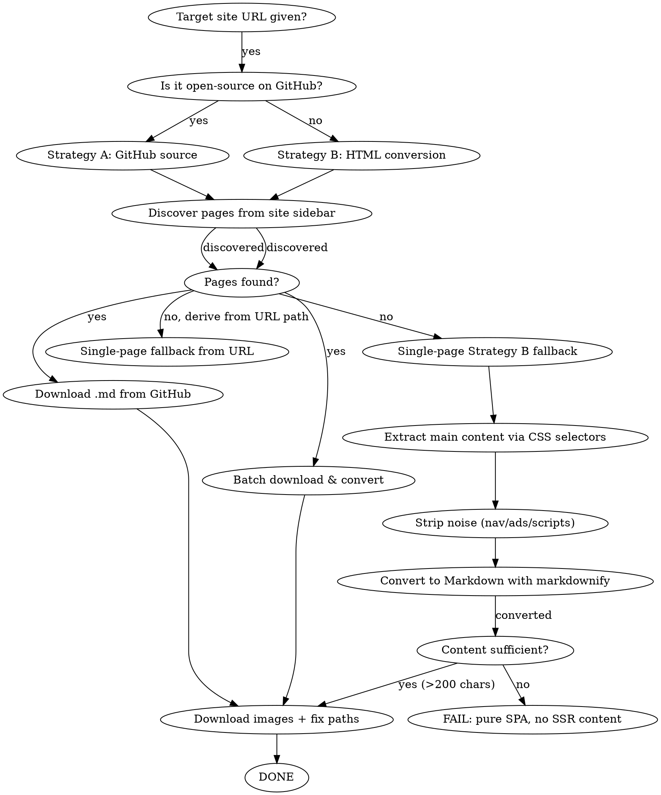

# Web to Local Markdown

Download an entire website section to local markdown files with all images, for offline reading in Typora, VS Code, or any markdown editor.

## Overview

Core principle: **GitHub source markdown > HTML conversion.** For open-source sites (VuePress, VitePress, docsify), the raw `.md` files on GitHub always beat HTML-to-markdown conversion. When GitHub source is unavailable, Strategy B extracts content directly from the page's HTML.

## Prerequisites

- **Python 3** — required
- **beautifulsoup4 + markdownify** — `pip install beautifulsoup4 markdownify` (Strategy B requires these)

## When to Use

- User says "download website to local", "save docs offline", "convert site to markdown"
- User wants to read VuePress/VitePress docs offline in Typora or VS Code
- User references a specific website URL and wants all its content + images locally

**When NOT to use:**
- Single page download (just use WebFetch)
- Non-documentation sites (news, social media)
- Sites with no structured navigation/sidebar

## Decision Flowchart



## Quick Reference

| Step | Tool | What it does |
|------|------|---------------|
| 1. Discover pages | Sidebar parsing or direct URL | Find all doc page URLs from site navigation, or use URL as single page |
| 2. Get source files | GitHub raw URLs or HTML extraction | Strategy A: download `.md` files. Strategy B: extract content from HTML |
| 3. Extract content | BeautifulSoup + markdownify | Strategy B: find main content, strip noise, convert to Markdown |
| 4. Download images | requests library | Save all PNG/SVG/JPEG to `images/` dir |
| 5. Fix paths | Python script | Replace remote URLs with local relative paths. Files in subdirectories use `../images/xxx.png`; files in root directory use `images/xxx.png` |

## Implementation

Run the core script:

```bash
python ${CLAUDE_PLUGIN_ROOT}/scripts/web_to_local_md.py --url "https://example.cn/docs/" --github-repo "owner/repo" --output-dir "./downloaded-docs"
```

**The script handles all steps automatically.** For manual/fallback approach, see references/common-issues.md.

## Link Policy

## Common Mistakes

| Mistake | What happens | Fix |
|---------|-------------|------|
| Using regex HTML→MD conversion | Empty headers, corrupted image URLs, lost tables, duplicated content | **Always prefer GitHub source .md files** |
| Image path = `images/xxx.png` (when file is in a subdirectory) | Typora looks in `subdir/images/` (wrong) | Use `../images/xxx.png` (relative to parent). When file is in root directory, use `images/xxx.png` instead |
| Curl downloads SPA HTML only | VuePress pages return skeleton (2551px height), no content | Use GitHub raw `.md` files instead |
| VuePress anchor-only headers | `<h2><a class="header-anchor"><span>Title</span></a></h2>` — removing `<a>` loses title text | Unwrap anchor, keep `<span>` text |
| URL-encoded filenames in images | `sub-agent%20.png` fails to match local file | Download with corrected URL, replace `%20` in references |
| Missing publication date | Output MD has title but no date context | Add `<small style="color:gray">YYYY-MM-DD</small>` below the H1 title, using the date from the original page. Only add the date — no author, category, or other metadata |

## Real-World Impact

Strategy B tested against 17 previously-failed SSR sites (AWS, Azure, GCP, OpenAI, Gemini, TensorFlow, D3.js, Grafana, etc.) — all now produce valid Markdown output.
