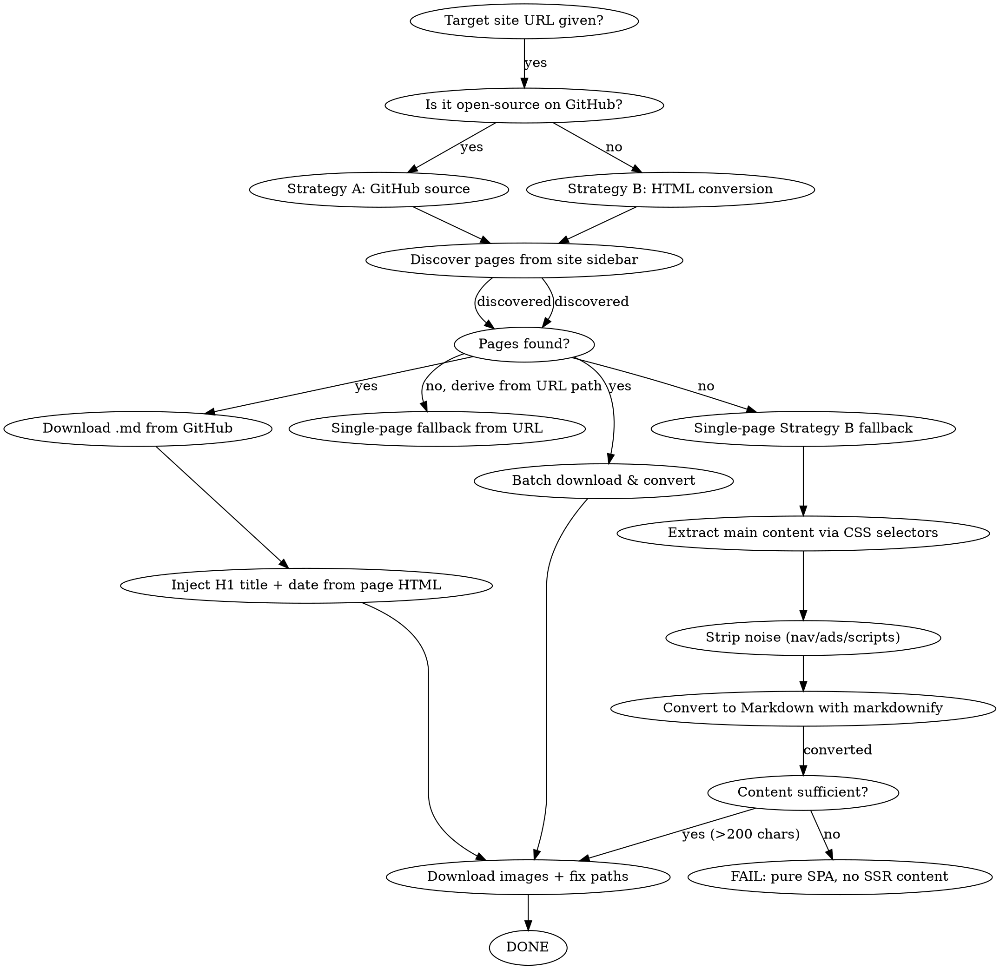

# Web to Local Markdown

Download an entire website section to local markdown files with all images, for offline reading in Typora, VS Code, or any markdown editor.

## Overview

Core principle: **GitHub source markdown > HTML conversion.** For open-source sites (VuePress, VitePress, docsify), the raw `.md` files on GitHub always beat HTML-to-markdown conversion. When GitHub source is unavailable, Strategy B extracts content directly from the page's HTML.

## Prerequisites

- **Python 3** — required
- **beautifulsoup4 + markdownify** — `pip install beautifulsoup4 markdownify` (Strategy B requires these)
- **requests** — `pip install requests` (used for all HTTP fetching: pages, GitHub source, images)

## When to Use

- User says "download website to local", "save docs offline", "convert site to markdown"
- User wants to read VuePress/VitePress docs offline in Typora or VS Code
- User references a specific website URL and wants all its content + images locally

**When NOT to use:**
- Single page download (just use WebFetch)
- Non-documentation sites (news, social media)
- Sites with no structured navigation/sidebar

## Decision Flowchart



## Quick Reference

| Step | Tool | What it does |
|------|------|---------------|
| 1. Discover pages | Sidebar parsing or direct URL | Find all doc page URLs from site navigation, or use URL as single page |
| 2. Get source files | GitHub raw URLs or HTML extraction | Strategy A: download `.md` files. Strategy B: extract content from HTML |
| 3. Clean & convert | BeautifulSoup + markdownify | Strategy B: strip noise → enrich image alts (`figcaption`/`title`) → convert image-gallery tables → unwrap anchor headers → normalize data-table headers (`<td>`→`<th>`) → convert to Markdown → clean artifacts (Copy/复制代码, anchor links, escaped bold, promo blocks, orphaned trailing headings). Strategy A: strip YAML frontmatter |
| 4. Inject metadata | `extract_page_metadata()` | Add `# H1 title` (if missing) + `<small style="color:gray">YYYY-MM-DD</small>` below it, extracted from the original page HTML. Both strategies |
| 5. Download images | requests library | Save all PNG/SVG/JPEG/WebP/AWEBP to `images/` dir; handle byteimg signed URLs and Next.js `/_next/image` proxies |
| 6. Fix paths + alts | `fix_image_paths()` / `fill_image_alt_text()` | Replace remote URLs with local relative paths (`../images/` in subdirs, `images/` at root). Fill empty/generic alts from filename, returning generic `image` for hash-dominated names |

## Implementation

Run the core script:

```bash
python ${CLAUDE_PLUGIN_ROOT}/scripts/web_to_local_md.py --url "https://example.cn/docs/" --github-repo "owner/repo" --output-dir "./downloaded-docs"
```

**The script handles all steps automatically.** For manual/fallback approach, see references/common-issues.md.

## Common Mistakes

| Mistake | What happens | Fix |
|---------|-------------|------|
| Using regex HTML→MD conversion | Empty headers, corrupted image URLs, lost tables, duplicated content | **Always prefer GitHub source .md files** |
| Image path = `images/xxx.png` (when file is in a subdirectory) | Typora looks in `subdir/images/` (wrong) | Use `../images/xxx.png` (relative to parent). When file is in root directory, use `images/xxx.png` instead |
| Curl downloads SPA HTML only | VuePress pages return skeleton (2551px height), no content | Use GitHub raw `.md` files instead |
| VuePress anchor-only headers | `<h2><a class="header-anchor"><span>Title</span></a></h2>` — removing `<a>` loses title text | Unwrap anchor, keep `<span>` text (handled by `unwrap_anchor_headers()`) |
| URL-encoded filenames in images | `sub-agent%20.png` fails to match local file | Download with corrected URL, replace `%20` in references |
| Missing publication date | Output MD has title but no date context | Add `<small style="color:gray">YYYY-MM-DD</small>` below the H1 title, using the date from the original page. Only add the date — no author, category, or other metadata (handled by `extract_page_metadata()`) |
| Missing H1 title | Output starts with `##` or plain text | Extract `<h1>` or `<title>` before noise stripping; inject as `# title` first line (handled by `extract_page_metadata()`) |
| "Copy"/"复制代码" artifacts | Button text appears in code blocks | `clean_html_artifacts()` removes these; copy-button classes in `NOISE_CLASSES` |
| byteimg signed image URLs | CDN URLs with `~tplv-xxx:0:0:0:0:token:q75.awebp` (contains `:`, crashes Windows filenames) | Match any `https://…​.<ext>` URL (regex allows `:` in path); `sanitize_filename()` replaces `:`/`<`/`>`/`|`/`?`/`*` with `-` before saving |
| Image filename mismatch / collision | Markdown references `images/foo.png` but the saved file is `images/<hash>-foo.png`; distinct images collapse to one name | Use ONE `url_to_local_filename()` for BOTH the markdown reference and the saved file — never strip the hash prefix from one side only |
| WordPress image-gallery tables | `<table><td><figure></figure></td></table>` → `| --- |` empty placeholders, 0 image refs | `convert_image_tables()` unwraps such tables into `<p></p>` before markdownify |
| Markdown 表格分隔行置于表头前 | CMS/doc tables render headers as `<td><b>Header</b></td>` instead of `<th>`; markdownify emits an empty header row that `clean_html_artifacts()` then strips, leaving `| --- |` ABOVE the header → table won't render | `normalize_tables()` promotes the first row's `<td>` to `<th>` for tables that lack `<th>` (before markdownify); tables that already have `<th>` are untouched |
| Orphaned trailing heading | Author-section heading (e.g. `## 本篇作者`) left behind after the author bios were stripped as noise — document ends on a heading with no body | `clean_html_artifacts()` drops a heading that has no content after it (a trailing heading is always leftover noise) |
| H1 title mojibake (Strategy A) | H1 shows `大模å…` instead of `大模型` — only the injected H1 is garbled, body is fine | `fetch_url()` sets `r.encoding = r.apparent_encoding` so sites omitting charset don't decode as ISO-8859-1 |
| Escaped bold `\\\*\\\*text\\\*\\\*` | markdownify escapes `*` in some contexts → bold won't render | `clean_html_artifacts()` unescapes `\\\*\\\*…\\\*\\\*` → `**…**` |
| Publication date above H1 | `<small>` date lands on line 1 (before the H1) instead of below it | `inject_metadata()` inserts the date on the line immediately AFTER the existing H1, never as a prefix |
| Empty image alt text | `` or ``, or alt = 40-char hash | `enrich_image_alts()` fills alt from `<figcaption>`/`title` first; `fill_image_alt_text()` falls back to filename, but returns generic `image` for hash-dominated names |

## Real-World Impact

Validated across 6 rounds of golden-dataset evaluation (7 cases spanning Anthropic, AWS, Alibaba Cloud, Meituan, InfoQ, Juejin, JavaGuide). Latest run (`2026-06-22_1930`): composite score 88.4% (⭐⭐⭐⭐ pass), structure 48/49 — the sole structural failure was case-2's broken table (separator above header), fixed this round by `normalize_tables()`; case-7's orphaned author heading also cleaned. Remaining accepted-as-minor gaps (alt text on CDN-named images, code-block language labels) do not affect offline-readability. See `evaluate-skill` golden reports under the data-sets output directory.
