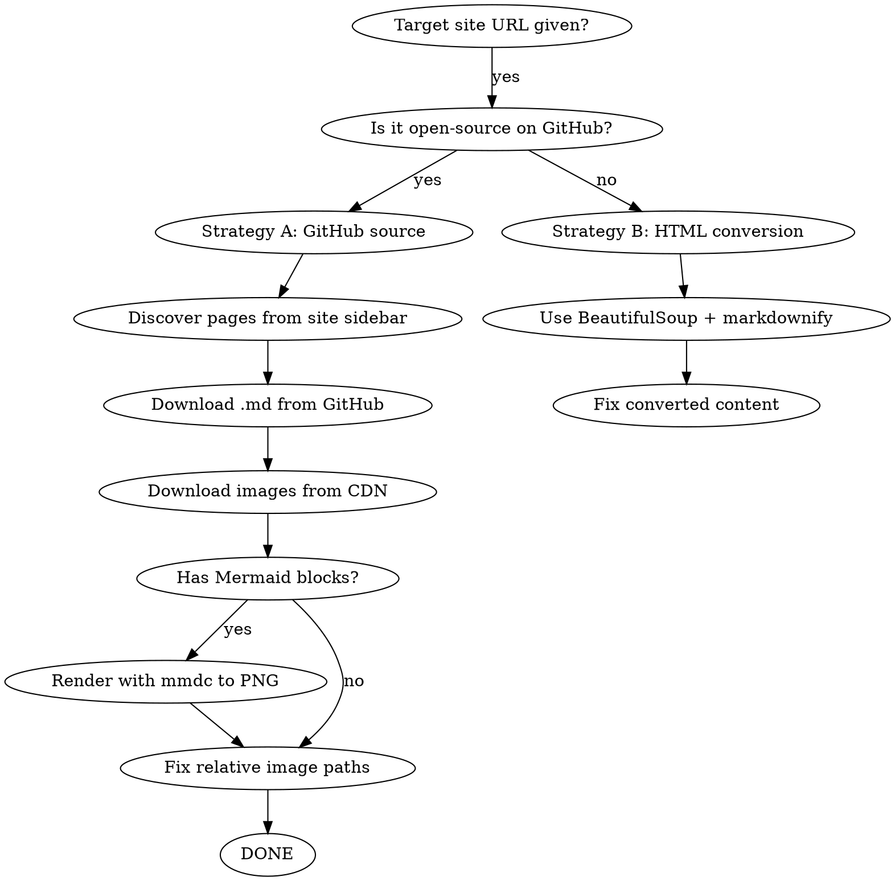

# Web to Local Markdown

Download an entire website section to local markdown files with all images, for offline reading in Typora, VS Code, or any markdown editor.

## Overview

Core principle: **GitHub source markdown > HTML conversion.** For open-source sites (VuePress, VitePress, docsify), the raw `.md` files on GitHub always beat HTML-to-markdown conversion. HTML conversion loses headers, corrupts image URLs, drops tables, and can't render lazy-loaded Mermaid diagrams.

## When to Use

- User says "download website to local", "save docs offline", "convert site to markdown"
- User wants to read VuePress/VitePress docs offline in Typora or VS Code
- User references a specific website URL and wants all its content + images locally

**When NOT to use:**
- Single page download (just use WebFetch)
- Non-documentation sites (news, social media)
- Sites with no structured navigation/sidebar

## Decision Flowchart



## Quick Reference

| Step | Tool | What it does |
|------|------|---------------|
| 1. Discover pages | WebFetch + sidebar parsing | Find all doc page URLs from site navigation |
| 2. Get source files | curl GitHub raw URLs | Download original `.md` files (best quality) |
| 3. Download images | curl oss/javaguide CDN URLs | Save all PNG/SVG/JPEG to `images/` dir |
| 4. Render Mermaid | mmdc CLI | Convert `\`\`\`mermaid` blocks to PNG images |
| 5. Fix paths | Python script | Change `images/` → `../images/` for Typora |
| 6. Clean up | Delete temp files | Remove HTML files, scripts, source dirs |

## Implementation

Run the core script:

```bash
python ${CLAUDE_PLUGIN_ROOT}/scripts/web_to_local_md.py --url "https://example.cn/docs/" --github-repo "owner/repo" --output-dir "./downloaded-docs"
```

**The script handles all 6 steps automatically.** For manual/fallback approach, see references/common-issues.md.

## Common Mistakes

| Mistake | What happens | Fix |
|---------|-------------|-----|
| Using regex HTML→MD conversion | Empty headers, corrupted image URLs, lost tables, duplicated content | **Always prefer GitHub source .md files** |
| Leaving `\`\`\`mermaid` code blocks | Users see raw `flowchart LR` code instead of diagrams | Render with mmdc to PNG, replace block with `` |
| Image path = `images/xxx.png` | Typora looks in `subdir/images/` (wrong) | Use `../images/xxx.png` (relative to parent) |
| Curl downloads SPA HTML only | VuePress pages return skeleton (2551px height), no content | Use GitHub raw `.md` files instead |
| VuePress anchor-only headers | `<h2><a class="header-anchor"><span>Title</span></a></h2>` — removing `<a>` loses title text | Unwrap anchor, keep `<span>` text |
| mmdc not found in Python subprocess | `[WinError 2]` on Windows | Use full path: `npm prefix -g` + `/mmdc.cmd` |
| URL-encoded filenames in images | `sub-agent%20.png` fails to match local file | Download with corrected URL, replace `%20` in references |

## Real-World Impact

Applied to JavaGuide AI section (javaguide.cn/ai/): 27 markdown docs, 117 images (94 original + 23 mermaid-rendered), 11.9 MB total. All viewable offline in Typora with proper relative paths and rendered flowcharts.
